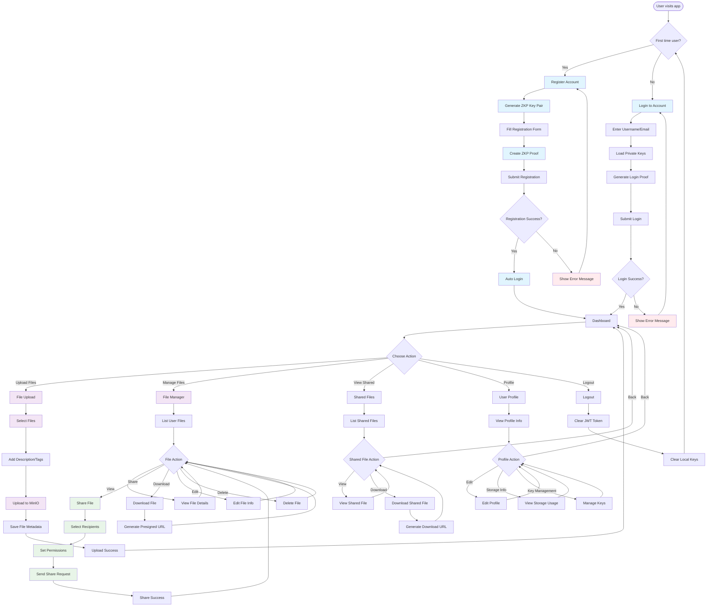
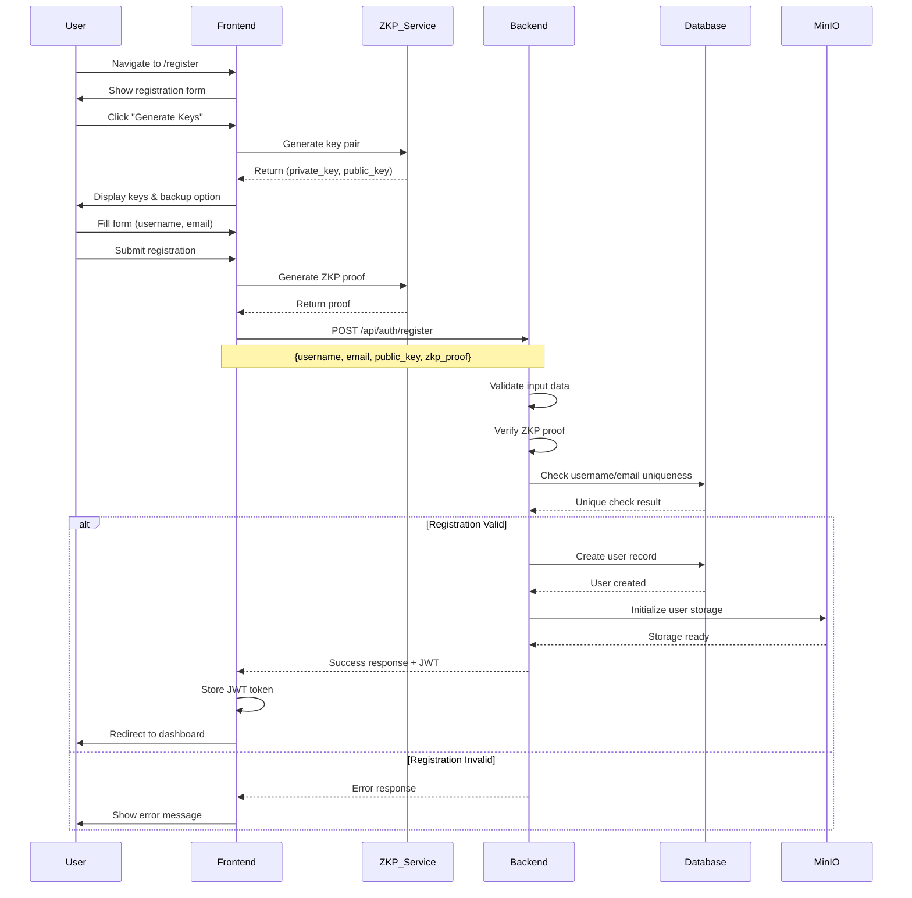
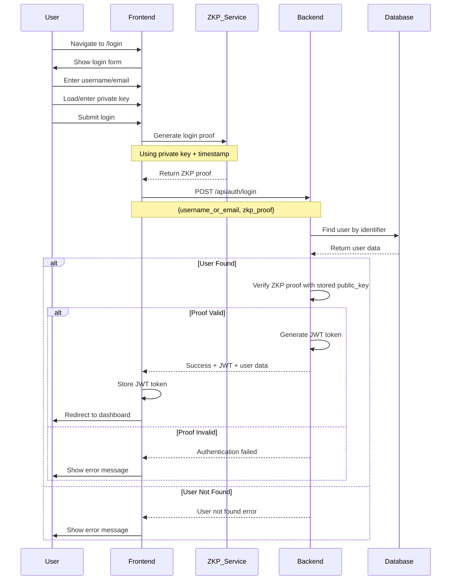
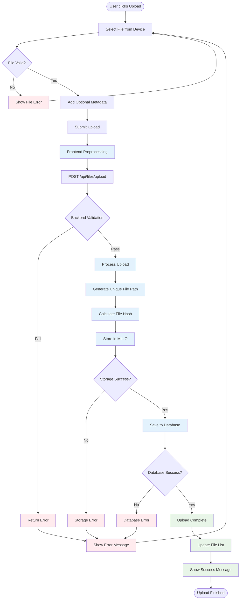
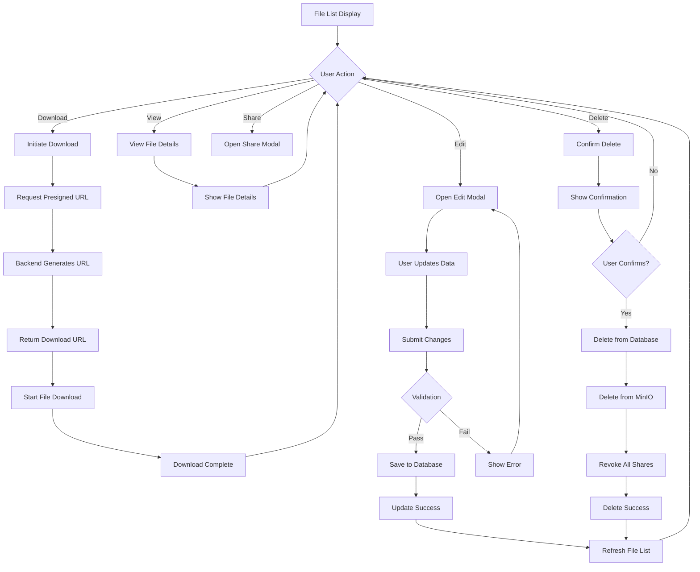
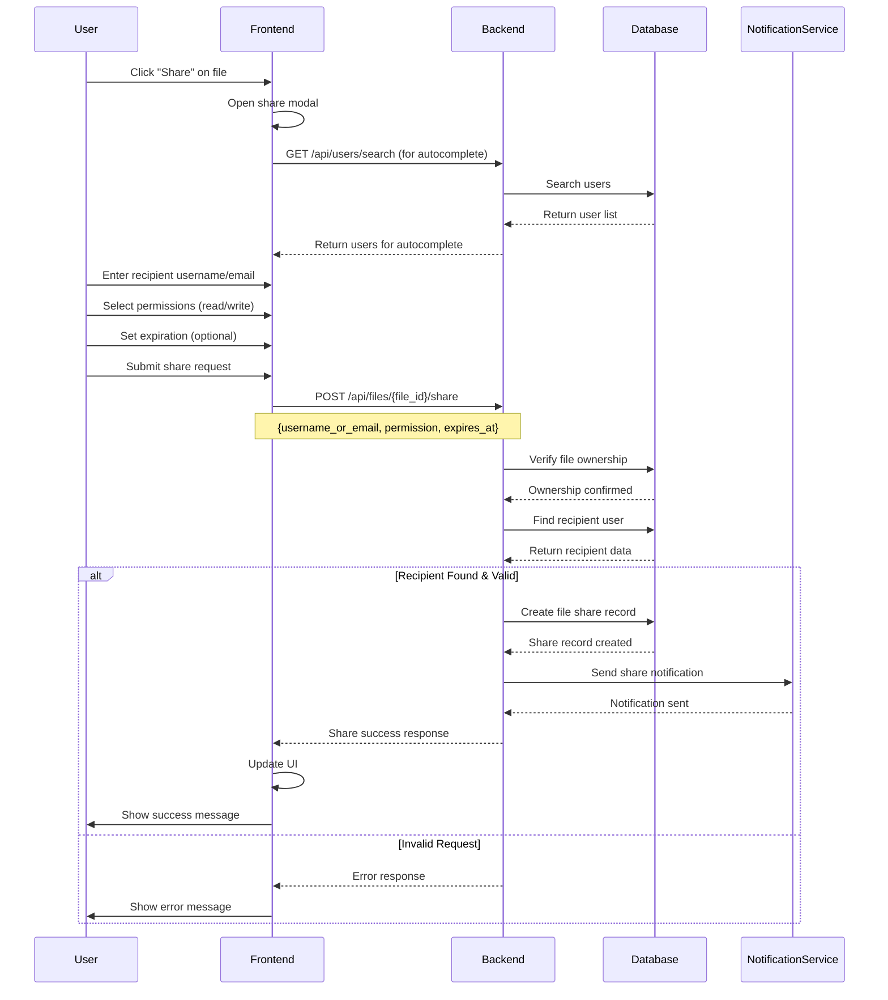
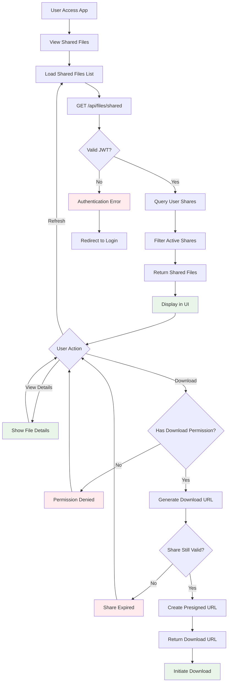
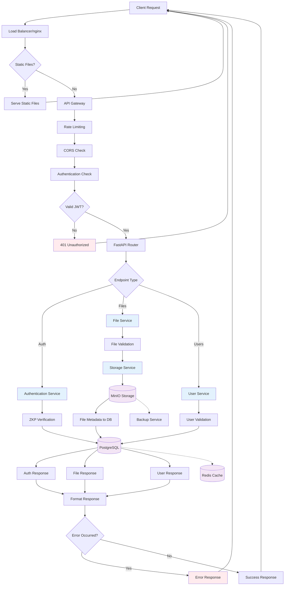

# ZKP File Sharing Application Flow

This document provides a comprehensive overview of the ZKP File Sharing application flow, including all user interactions, system processes, and feature workflows using Mermaid diagrams.

## Table of Contents

- [Overview](#overview)
- [Complete User Journey](#complete-user-journey)
- [Authentication Flow](#authentication-flow)
- [File Management Flow](#file-management-flow)
- [File Sharing Flow](#file-sharing-flow)
- [System Architecture Flow](#system-architecture-flow)
- [Error Handling Flow](#error-handling-flow)
- [Security Flow](#security-flow)

## Overview

The ZKP File Sharing application provides a secure, privacy-preserving platform for file storage and sharing using Zero-Knowledge Proof authentication. This document illustrates the complete user journey and system interactions.

### Key Features Covered
- ✅ ZKP-based Registration & Authentication
- ✅ Secure File Upload & Storage
- ✅ File Management (CRUD operations)
- ✅ File Sharing with Permissions
- ✅ File Download with Presigned URLs
- ✅ User Profile Management
- ✅ JWT Session Management
- ✅ Real-time File Listing
- ✅ Storage Analytics

## Complete User Journey



## Authentication Flow

### Registration Process



### Login Process



## File Management Flow

### File Upload Process



### File Operations Flow



## File Sharing Flow

### Share File Process



### Access Shared File



## System Architecture Flow

### Request Processing Flow



## Error Handling Flow

```mermaid
flowchart TD
    Error[Error Occurs] --> ErrorType{Error Type}
    
    ErrorType -->|Authentication| AuthError[Authentication Error]
    ErrorType -->|Validation| ValidationError[Validation Error]
    ErrorType -->|File System| FileError[File System Error]
    ErrorType -->|Database| DBError[Database Error]
    ErrorType -->|Network| NetworkError[Network Error]
    ErrorType -->|Unknown| UnknownError[Unknown Error]
    
    %% Authentication Errors
    AuthError --> AuthSubType{Auth Error Type}
    AuthSubType -->|Invalid Token| InvalidToken[Token Invalid/Expired]
    AuthSubType -->|ZKP Failed| ZKPFailed[ZKP Verification Failed]
    AuthSubType -->|User Not Found| UserNotFound[User Not Found]
    
    InvalidToken --> RedirectLogin[Redirect to Login]
    ZKPFailed --> ShowAuthError[Show Auth Error Message]
    UserNotFound --> ShowUserError[Show User Error Message]
    
    %% Validation Errors
    ValidationError --> ValidationDetail[Extract Validation Details]
    ValidationDetail --> ShowFieldErrors[Show Field-Specific Errors]
    
    %% File System Errors
    FileError --> FileSubType{File Error Type}
    FileSubType -->|Upload Failed| UploadFailed[Upload Failed]
    FileSubType -->|Download Failed| DownloadFailed[Download Failed]
    FileSubType -->|Storage Full| StorageFull[Storage Quota Exceeded]
    FileSubType -->|File Not Found| FileNotFound[File Not Found]
    
    UploadFailed --> ShowUploadError[Show Upload Error]
    DownloadFailed --> ShowDownloadError[Show Download Error]
    StorageFull --> ShowQuotaError[Show Quota Error]
    FileNotFound --> Show404Error[Show 404 Error]
    
    %% Database Errors
    DBError --> DBSubType{DB Error Type}
    DBSubType -->|Connection Failed| DBConnection[Connection Error]
    DBSubType -->|Query Failed| QueryFailed[Query Error]
    DBSubType -->|Constraint Violation| ConstraintError[Constraint Error]
    
    DBConnection --> ShowDBError[Show Database Error]
    QueryFailed --> ShowQueryError[Show Query Error]
    ConstraintError --> ShowConstraintError[Show Constraint Error]
    
    %% Network Errors
    NetworkError --> NetworkSubType{Network Error Type}
    NetworkSubType -->|Timeout| TimeoutError[Request Timeout]
    NetworkSubType -->|Connection Lost| ConnectionLost[Connection Lost]
    NetworkSubType -->|Server Error| ServerError[Server Error]
    
    TimeoutError --> ShowTimeoutError[Show Timeout Error]
    ConnectionLost --> ShowConnectionError[Show Connection Error]
    ServerError --> ShowServerError[Show Server Error]
    
    %% Unknown Errors
    UnknownError --> LogError[Log Error Details]
    LogError --> ShowGenericError[Show Generic Error]
    
    %% Error Recovery
    ShowAuthError --> RetryAuth[Offer Retry Authentication]
    ShowUserError --> RetryAuth
    ShowFieldErrors --> FixAndRetry[Allow User to Fix and Retry]
    ShowUploadError --> RetryUpload[Offer Retry Upload]
    ShowDownloadError --> RetryDownload[Offer Retry Download]
    ShowQuotaError --> ManageStorage[Redirect to Storage Management]
    Show404Error --> BackToList[Back to File List]
    ShowDBError --> TryAgainLater[Show Try Again Message]
    ShowQueryError --> TryAgainLater
    ShowConstraintError --> FixAndRetry
    ShowTimeoutError --> RetryRequest[Offer Retry Request]
    ShowConnectionError --> CheckConnection[Check Connection Message]
    ShowServerError --> TryAgainLater
    ShowGenericError --> ContactSupport[Show Contact Support]
    
    classDef errorType fill:#ffebee
    classDef errorAction fill:#fff3e0
    classDef recovery fill:#e8f5e8
    
    class AuthError,ValidationError,FileError,DBError,NetworkError,UnknownError errorType
    class ShowAuthError,ShowFieldErrors,ShowUploadError,ShowDBError,ShowTimeoutError,ShowGenericError errorAction
    class RetryAuth,FixAndRetry,RetryUpload,ManageStorage,ContactSupport recovery
```



## Security Flow

### Security Validation Pipeline

```mermaid
flowchart TD
    Request[Incoming Request] --> InputValidation[Input Validation]
    
    InputValidation --> SanitizeInput[Sanitize Input Data]
    SanitizeInput --> ValidateSchema[Validate Against Schema]
    ValidateSchema --> SchemaValid{Schema Valid?}
    
    SchemaValid -->|No| ValidationError[Return Validation Error]
    SchemaValid -->|Yes| AuthCheck[Authentication Check]
    
    AuthCheck --> JWTValid{JWT Valid?}
    JWTValid -->|No| AuthError[Return Auth Error]
    JWTValid -->|Yes| ExtractUser[Extract User from JWT]
    
    ExtractUser --> AuthorizeAction[Authorize Action]
    AuthorizeAction --> HasPermission{Has Permission?}
    
    HasPermission -->|No| PermissionError[Return Permission Error]
    HasPermission -->|Yes| RateLimit[Rate Limiting Check]
    
    RateLimit --> RateLimitOK{Rate Limit OK?}
    RateLimitOK -->|No| RateLimitError[Return Rate Limit Error]
    RateLimitOK -->|Yes| ProcessRequest[Process Request]
    
    ProcessRequest --> FileOperation{File Operation?}
    
    FileOperation -->|Yes| FileSecurityCheck[File Security Check]
    FileOperation -->|No| NonFileOperation[Non-File Operation]
    
    %% File Security Checks
    FileSecurityCheck --> CheckFileOwnership[Check File Ownership]
    CheckFileOwnership --> OwnershipValid{Ownership Valid?}
    
    OwnershipValid -->|No| OwnershipError[Return Ownership Error]
    OwnershipValid -->|Yes| CheckFileAccess[Check File Access Rights]
    
    CheckFileAccess --> AccessValid{Access Valid?}
    AccessValid -->|No| AccessError[Return Access Error]
    AccessValid -->|Yes| VirusScan[Virus Scan (Upload)]
    
    VirusScan --> VirusClean{File Clean?}
    VirusClean -->|No| VirusError[Return Virus Error]
    VirusClean -->|Yes| FileProcessing[File Processing]
    
    %% Non-file operations
    NonFileOperation --> DataValidation[Data Validation]
    DataValidation --> BusinessLogic[Business Logic Validation]
    BusinessLogic --> ExecuteOperation[Execute Operation]
    
    FileProcessing --> ExecuteOperation
    
    ExecuteOperation --> AuditLog[Create Audit Log]
    AuditLog --> SuccessResponse[Return Success Response]
    
    %% Error Responses
    ValidationError --> LogError[Log Security Event]
    AuthError --> LogError
    PermissionError --> LogError
    RateLimitError --> LogError
    OwnershipError --> LogError
    AccessError --> LogError
    VirusError --> LogError
    
    LogError --> SecurityResponse[Return Security Error Response]
    
    classDef securityCheck fill:#e3f2fd
    classDef errorResponse fill:#ffebee
    classDef successPath fill:#e8f5e8
    
    class InputValidation,AuthCheck,AuthorizeAction,FileSecurityCheck,CheckFileOwnership,CheckFileAccess securityCheck
    class ValidationError,AuthError,PermissionError,OwnershipError,AccessError,VirusError errorResponse
    class ProcessRequest,FileProcessing,ExecuteOperation,SuccessResponse successPath
```

This comprehensive application flow documentation provides a complete picture of how users interact with the ZKP File Sharing application, from initial registration through all file management operations. Each diagram shows the decision points, error handling, and security considerations that make the application robust and user-friendly. 